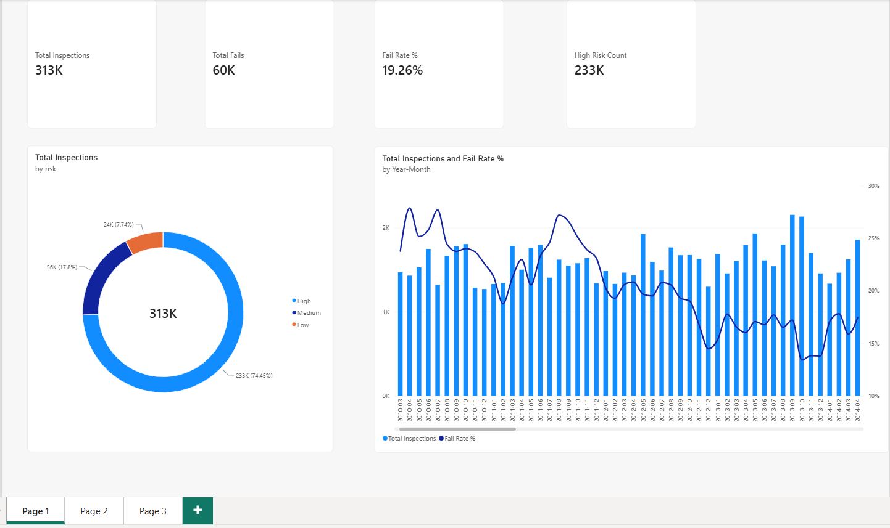
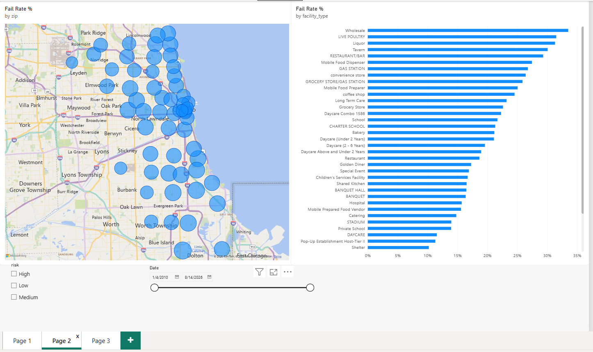
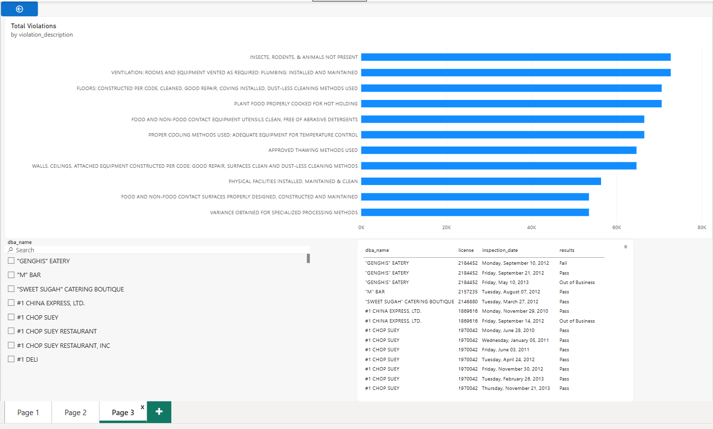

# Chicago Food Inspections: End-to-End BI Pipeline

This project transforms raw Chicago food inspection data into an interactive executive dashboard. It demonstrates a full-stack Business Intelligence pipeline, bridging a relational PostgreSQL backend with a Power BI presentation layer using a strict star-schema data model.

## Dashboard Views

**1. Executive KPI Overview**  
Tracks high-level compliance health, year-over-year failure trends, and risk distribution.  

**2. Geospatial & Risk Heatmap**  
Maps geographic risk concentrations across Chicago ZIP codes and filters failure rates by facility type to isolate systemic issues.  

**3. Violation Deep-Dive & Audit Log**  
Applies a Pareto analysis to isolate the top 10 most frequent compliance failures, paired with a searchable facility-level audit table.  

## Technical Architecture

* **Backend:** PostgreSQL (Data cleaning, normalization, and view materialization)
* **Frontend:** Power BI Desktop
* **Data Modeling:** Star Schema architecture (Fact and Dimension tables) with a dedicated Date Table for temporal DAX calculations
* **Calculations:** Custom DAX measures for dynamic failure rates, risk counts, and visual-level filtering

## Repository Structure

* `dashboard/` - Contains the `powerbi.pbix` file and presentation screenshots.
* `data/` - Contains `raw/` and `processed/` data extracts.
* `notebooks/` - Jupyter notebooks used for initial exploratory data analysis.
* `schema/` - Database schema configurations.
* `scripts/` - ETL scripts for data ingestion and transformation.
* `sql/` - SQL queries for generating analytical views and fact/dimension tables.
